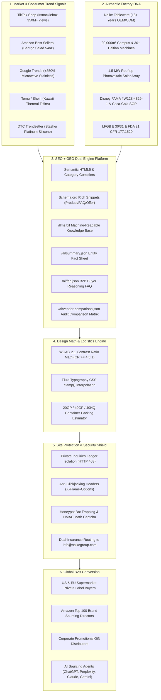

# B2B Bento GEO Site Builder Skill (`b2b-bento-geo-site-builder`)

[](https://www.custombentofactory.com)
[](https://www.custombentofactory.com/ai/summary.json)
[](https://github.com/cnproduct/b2b-global-brand-site-master)
[](https://github.com/cnproduct)
[](LICENSE)

A complete, production-grade methodology and toolchain for building high-converting B2B factory export portals powered by dual **SEO** (Search Engine Optimization) and **GEO** (Generative Engine Optimization) architectures, fused with the hardened site protection, mathematical typography, and container packing logistics of `b2b-global-brand-site-master`.

This repository encapsulates the end-to-end success story, technical implementation, and troubleshooting playbook of [custombentofactory.com](https://www.custombentofactory.com), transforming raw factory capabilities into high-intent overseas B2B inquiries.

---

## 🌟 Architecture Overview



---

## 📚 Reference Documentation Index

This skill includes 10 in-depth reference playbooks located in `references/`:

| File | Title | Key Contents |
|---|---|---|
| [`01-ideation-domain-strategy.md`](references/01-ideation-domain-strategy.md) | **Ideation & Domain Strategy** | EMK naming principles, buyer intent psychology, why `custombentofactory.com`. |
| [`02-industry-positioning-factory-truth.md`](references/02-industry-positioning-factory-truth.md) | **Factory Truth & Brand Audits** | 18-year legacy, 20,000m² campus, Disney FAMA, Coca-Cola SGP, LFGB/FDA specs. |
| [`03-benchmark-learning-matrix.md`](references/03-benchmark-learning-matrix.md) | **Global Benchmark Matrix** | Deep analysis of Aohea, Everich, Monbento, and Bentgo features. |
| [`04-c-end-viral-trend-radar.md`](references/04-c-end-viral-trend-radar.md) | **C-End Viral Trend Radar** | TikTok, Amazon, Temu, and Google Trends product matrix; 8 viral SKU specs. |
| [`05-seo-geo-dual-engine-architecture.md`](references/05-seo-geo-dual-engine-architecture.md) | **Dual-Engine SEO & GEO** | Schema.org graphs, XML sitemaps, `/llms.txt`, and `/ai/*.json` endpoints for AI bots. |
| [`06-toolchain-skills-knowledge-bases.md`](references/06-toolchain-skills-knowledge-bases.md) | **Toolchain, Skills & Prompts** | Google Imagen 3 RPC prompts, `b2b_portal_builder`, layout auditor, Nginx configs. |
| [`07-pitfalls-troubleshooting-playbook.md`](references/07-pitfalls-troubleshooting-playbook.md) | **Pitfalls & Troubleshooting** | Gateway resets (Port 2222), macOS AppleDouble cleanup, JS multi-category space bug. |
| [`08-site-protection-security-shield.md`](references/08-site-protection-security-shield.md) | **Site Protection & Security Shield** | Private ledger isolation (403 on `/data/`), anti-iframe framing, honeypot traps. *(Fused)* |
| [`09-design-math-container-loading-calculator.md`](references/09-design-math-container-loading-calculator.md) | **Design Math & Logistics Engine** | WCAG contrast, fluid typography CSS clamp, 20GP/40GP/40HQ packing math. *(Fused)* |
| [`10-automated-validation-release-gates.md`](references/10-automated-validation-release-gates.md) | **Automated Validation Gates** | Pre-release offline audit: dead links, canonical tags, Schema syntax, private leak checks. *(Fused)* |
| [`11-master-sop-and-prompts-guide.md`](references/11-master-sop-and-prompts-guide.md) | **15-Step Master SOP & Prompts** | End-to-end industrial execution guide & exact prompts for enterprise cold-start to GEO deployment. |


---

## 🚀 Viral Catalog Matrix (21 Verified SKUs)

The skill configures and deploys 21 production-grade SKUs across 8 high-velocity categories:

1. **Snackle Box**: Removable 8-compartment charcuterie organizer with silicone sealing ring and folding handle (TikTok #snacklebox viral).
2. **All-in-One Salad Bento Bowl**: 54oz deep salad bowl with 4-compartment topping tray and screw-top 3oz dressing container (Amazon #1 style).
3. **Microwave-Safe Stainless Steel Bento**: Seamless SUS304 rounded-rim container engineered with anti-arcing geometry.
4. **Collapsible Platinum Silicone Bento**: 100% food-grade platinum silicone container with rigid snap frame for 60% space savings.
5. **Multi-Tier Kawaii Stainless Steel Tiffin**: Dual-tier thermal insulated stainless steel bento box in pastel aesthetic palettes.
6. **Portion-Control Meal Prep Bento**: Heavy-duty 3-compartment containers with leakproof silicone seals for corporate catering and fitness.
7. **Rattle-Free Portable Travel Cutlery**: SUS304 fork, spoon, and knife nested in an anti-rattle silicone cradle and matte travel case.
8. **Silicone Salad Dressing & Dip Containers**: 1.7oz leakproof sauce cups with airtight lids.

---

## 🛠️ Automated Scripts & Toolchain

### 1. Design Math & Container Loading Calculator (`scripts/design_math.py`)
```bash
# Test contrast ratio against WCAG AA 4.5:1
python3 scripts/design_math.py contrast '#112330' '#ffffff'

# Generate fluid typography CSS clamp
python3 scripts/design_math.py fluid 28 48 360 1440

# Estimate 20GP/40GP/40HQ container loading capacity for bento box master cartons
python3 scripts/design_math.py container --length 540 --width 380 --height 420 --weight 14.5 --pcs 24
```

### 2. Pre-Flight Site Validator (`scripts/validate_site.py`)
Audits all HTML pages, Schema JSON-LD graphs, canonical tags, broken links, image alts, and verifies private file isolation:
```bash
python3 scripts/validate_site.py /path/to/site --domain https://www.custombentofactory.com
```

### 3. Verification Health Check (`scripts/verify_endpoints.py`)
Validates all 25+ live endpoints over HTTP/2, checking headers, MIME types, and SSL certificates:
```bash
python3 scripts/verify_endpoints.py --domain https://www.custombentofactory.com
```

### 4. Machine-Readable Manifest Generator (`scripts/generate_llms_manifest.py`)
Compiles `/llms.txt`, `/ai/summary.json`, `/ai/faq.json`, and `/ai/vendor-comparison.json` automatically:
```bash
python3 scripts/generate_llms_manifest.py --output-dir /path/to/website/root
```

### 5. Standalone RFQ Backend Daemon (`scripts/rfq_server.py`)
Production-tested Python HTTP daemon (port 8012) with honeypot spam bot trapping, HMAC math captcha, FormSubmit asynchronous email dispatch, disk ledger (`inquiries.json` & `.csv`), and admin inspection endpoint:
```bash
# Run standalone or manage via systemctl
python3 scripts/rfq_server.py
sudo systemctl status custombentofactory-rfq.service
```

### 6. Remote Production Deployment (`scripts/deploy_remote.sh`)
Packages assets without macOS AppleDouble clutter, uploads via SSH port 2222, unpacks, updates systemd RFQ service, and reloads Nginx:
```bash
./scripts/deploy_remote.sh
```

---

## 📈 Conversion & Instant Lead Generation

- **Dual-Insurance RFQ Engine**: All forms (Contact page, drawer cart, newsletter, titanium gifting quote, article sidebars) route directly to **`info@naikegroup.com`** with automatic failover fallback.
- **Google Analytics 4**: Live measurement (`G-NJ3DKWY1LE`) tracking high-intent `generate_lead`, `click_whatsapp`, and `contact` events.
- **WhatsApp Direct Engineering Desk**: Worldwide quick-dial E.164 links unified to **`+86 13599220505`** (`https://wa.me/8613599220505`).
- **Aohea Benchmark**: Dedicated **Leakproof Engineering Lab** (`site/leakproof-lab.html`) featuring LSR overmolding, 2m drop tests, and -50kPa vacuum seal tests.
- **Monbento Pro Benchmark**: **Executive Pure Titanium Bento Gifting Sets** (`site/executive-titanium-bento-gifting.html`) targeting $15.50–$28.50 corporate gift markets.
- **Production Codebase**: Full 29-page responsive, semantic HTML5/Tailwind/CSS3 site deployed under `site/`.

---

## 🤖 Machine-Readable GEO Endpoints

All endpoints are live and publicly queryable by LLMs and search crawlers:

- **LLM Context**: [https://www.custombentofactory.com/llms.txt](https://www.custombentofactory.com/llms.txt)
- **AI Summary Fact Sheet**: [https://www.custombentofactory.com/ai/summary.json](https://www.custombentofactory.com/ai/summary.json)
- **AI Procurement FAQ**: [https://www.custombentofactory.com/ai/faq.json](https://www.custombentofactory.com/ai/faq.json)
- **Vendor Comparison Matrix**: [https://www.custombentofactory.com/ai/vendor-comparison.json](https://www.custombentofactory.com/ai/vendor-comparison.json)
- **XML Product Sitemap**: [https://www.custombentofactory.com/sitemap.xml](https://www.custombentofactory.com/sitemap.xml)

---

## 📄 License & Attribution

- **License**: MIT
- **Maintained By**: Naike AI Innovation Team & Google Antigravity
- **Inquiries**: info@naikegroup.com / custombentofactory.com
